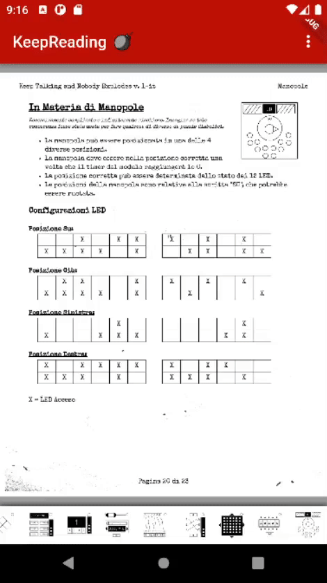
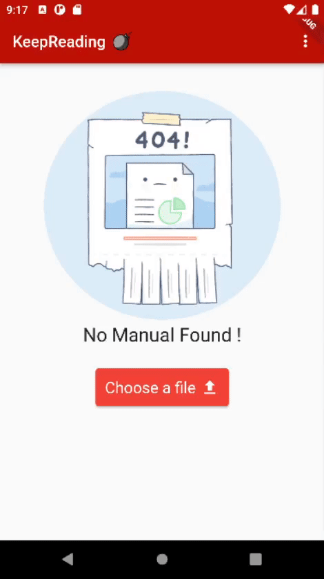

   
<p align="center">
    
    <h1 align="center">KeepReading</h1>
</p>

**KeepReading** is a Mobile (Android/IOS) Cross-Platform App wrapper for the _Keep Talking and Nobody Explodes_ manual.
It helps you to jump directly to a specific section of the manual with just a tap 🚀!

<p align="center"> </p>

## Features 🚀

<p align="center"> 
    
    
    
    
    
</p>

- Select and Import PDFs from phone storage
- Auto update check with GitHub Releases
- Quick Jump to PDFs section via buttons
- Pre-rendering PDF's pages to avoid lag when using the app

## Install ⬇️

[](https://codemagic.io/apps/629f525050f339bef537fc16/629f525050f339bef537fc15/latest_build)

Download the APK/APP.ZIP file from this link [Latest Release](https://github.com/ncvescera/KeepReading/releases/latest) and just install it !

_Builds are made with ❤️ by [CodeMagic](https://codemagic.io/start/)!_

## Build from Source ⚙️

1. Clone the repo: 
    ```
    git clone https://github.com/ncvescera/KeepReading.git
    cd KeepReading/KeepReading
    ```
2. Get all required packages:
    ```
    flutter pub get
    ```
3. Build the apk/ipa with
    ```
    flutter build apk
    flutter build ipa
    ```

For more info see: 
- [Deploy on Android](https://docs.flutter.dev/deployment/android)
- [Deploy on IOS](https://docs.flutter.dev/deployment/ios)

## Future Updates 💪

- [ ] IOS release
- [ ] Page Helpers, some tools that help you with specific blocks e.g. pre-calculated intersections in complex cables, ecc
- [ ] Desktop version ??
- [ ] Better performance when PDF is pre-rendering pages (there is a problems with Isolate module and PDF reader: [issue](https://github.com/ScerIO/packages.flutter/issues/299))
